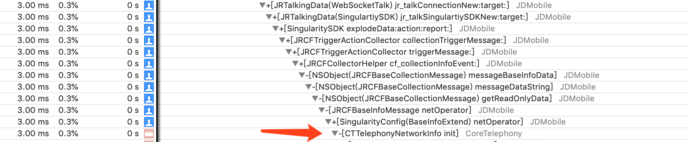
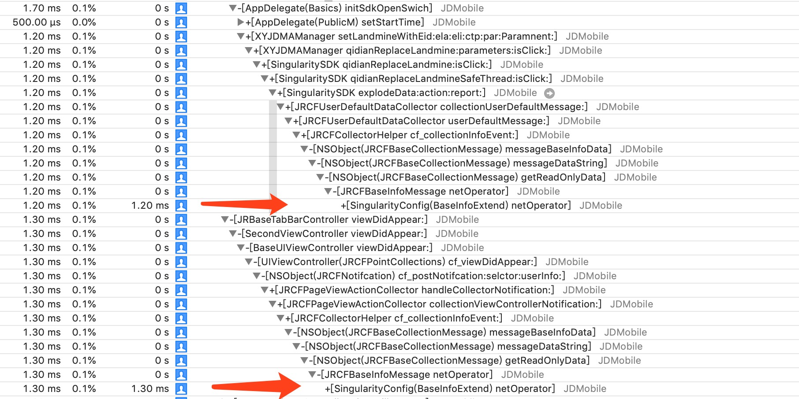
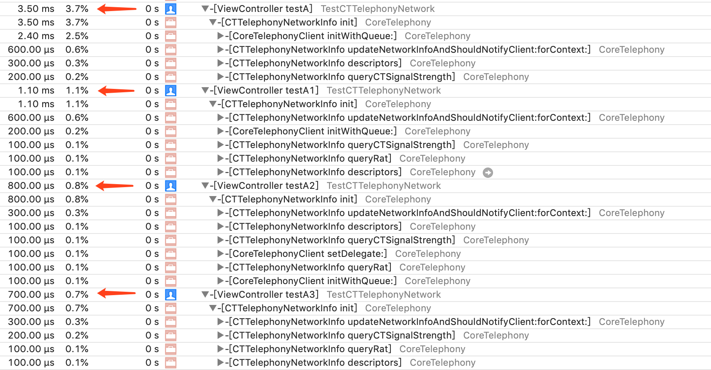
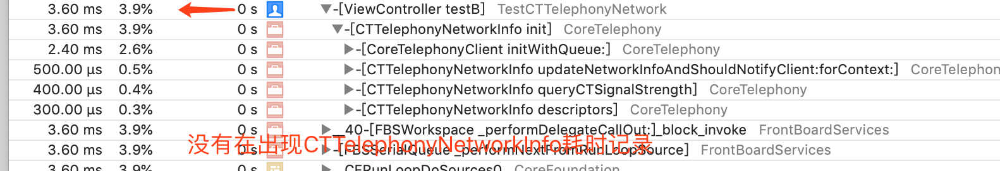

## ❗️埋点：+[XYJDMAManager qidianReplaceLandmine:parameters:isClick:] 5.30 ms

- 不涉及UI的异步线程执行

- 首次执行耗时3ms

- 非首次执行，每次执行消耗3ms


- 测试代码

```
@implementation ViewController

- (void)viewDidLoad {
    [super viewDidLoad];    
    [self testA];
    [self testA1];
    [self testA2];
    [self testA3];
}

- (void)testA {
    CTTelephonyNetworkInfo *info = [[CTTelephonyNetworkInfo alloc] init];
    CTCarrier *carrier = [info subscriberCellularProvider];
    info = nil;
    carrier = nil;
}

- (void)testA1 {
    CTTelephonyNetworkInfo *info = [[CTTelephonyNetworkInfo alloc] init];
    CTCarrier *carrier = [info subscriberCellularProvider];
    info = nil;
    carrier = nil;
}
- (void)testA2 {
    CTTelephonyNetworkInfo *info = [[CTTelephonyNetworkInfo alloc] init];
    CTCarrier *carrier = [info subscriberCellularProvider];
    info = nil;
    carrier = nil;
}

- (void)testA3 {
    CTTelephonyNetworkInfo *info = [[CTTelephonyNetworkInfo alloc] init];
    CTCarrier *carrier = [info subscriberCellularProvider];
    info = nil;
    carrier = nil;
}
@end
```

```
- (void)testB {
    CTTelephonyNetworkInfo *info = self.info?:[[CTTelephonyNetworkInfo alloc] init];
    CTCarrier *carrier = [info subscriberCellularProvider];
    self.info = info;
    carrier = nil;
}
- (void)testB1 {
    CTTelephonyNetworkInfo *info = self.info?:[[CTTelephonyNetworkInfo alloc] init];
    CTCarrier *carrier = [info subscriberCellularProvider];
    self.info = info;
    carrier = nil;
}
- (void)testB2 {
    CTTelephonyNetworkInfo *info = self.info?:[[CTTelephonyNetworkInfo alloc] init];
    CTCarrier *carrier = [info subscriberCellularProvider];
    self.info = info;
    carrier = nil;
}
- (void)testB3 {
    CTTelephonyNetworkInfo *info = self.info?:[[CTTelephonyNetworkInfo alloc] init];
    CTCarrier *carrier = [info subscriberCellularProvider];
    self.info = info;
    carrier = nil;
}
```

- 测试结果




- 结果分析

避免重复创建CTTelephonyNetworkInfo对象即可。


